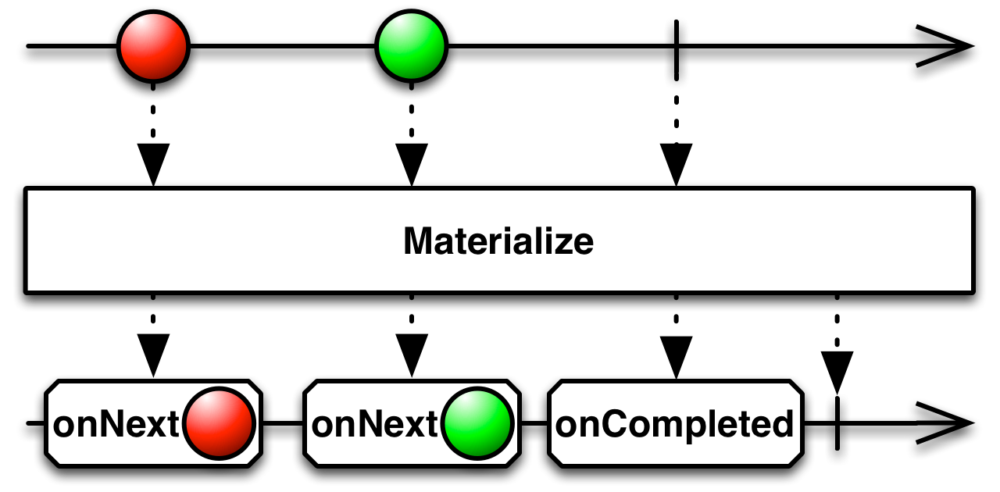
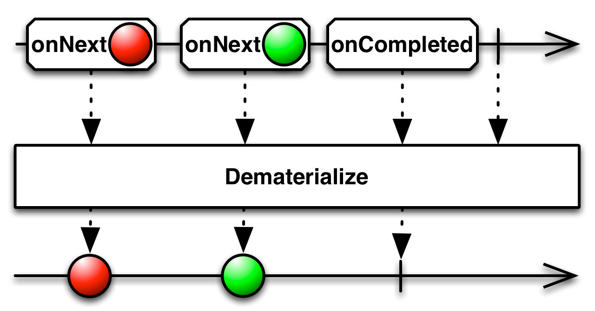
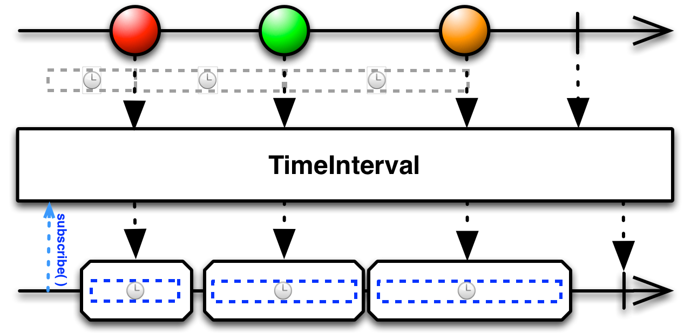
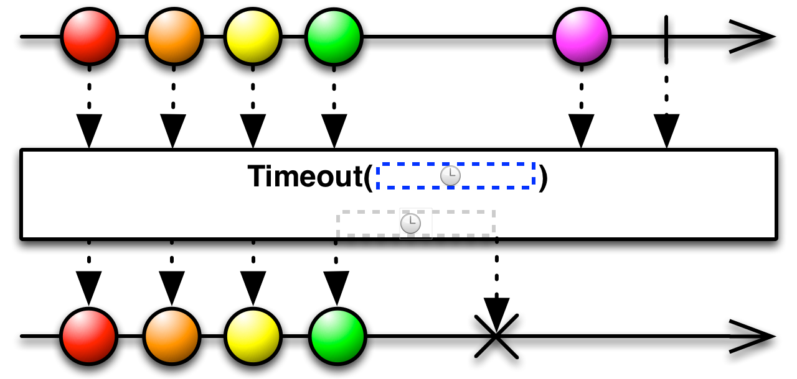
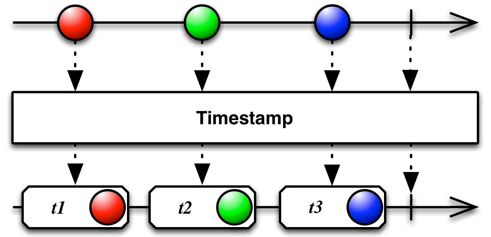

# Utility Operators
A toolbox of useful Operators for working with `Observables`:
- `Delay` — shift the emissions from an `Observable` forward in time by a particular amount;
- `Do` — register an action to take upon a variety of Observable lifecycle events;
- `Materialize/Dematerialize` — represent both the items emitted and the notifications sent as emitted items, or reverse this process;
- `TimeInterval` — convert an `Observable` that emits items into one that emits indications of the amount of time elapsed between those emissions;
- `Timeout` — mirror the source `Observable`, but issue an error notification if a particular period of time elapses without any emitted items;
- `Timestamp` — attach a timestamp to each item emitted by an `Observable`.

### [Delay](http://reactivex.io/documentation/operators/delay.html)
Shift the emissions from an `Observable` forward in time by a particular amount.

The *Delay* operator modifies its source `Observable` by pausing for a particular increment of time (that you specify) before emitting each of the source Observable’s items. This has the effect of shifting the entire sequence of items emitted by the `Observable` forward in time by that specified increment.


```
fun delay() {
    Observable.just(1, 2, 3)
            .delay(5000, TimeUnit.MILLISECONDS)
            .subscribe(
                    { result -> println("Next item = $result") },
                    { println("onError") },
                    { println("onComplete") }
            )
}
```

Output:
```
Next item = 1
Next item = 2
Next item = 3
onComplete
```

### [Do](http://reactivex.io/documentation/operators/do.html)
Register an action to take upon a variety of `Observable` lifecycle events.

You can register callbacks that ReactiveX will call when certain events take place on an `Observable`, where those callbacks will be called independently from the normal set of notifications associated with an `Observable` cascade.


```
fun doExample() {
    Observable.just(1, 2, 3)
            .doOnSubscribe { println("doOnSubscribe") }
            .doOnError { println("doOnError") }
            .doOnEach { println("doOnEach") }
            .doOnTerminate { println("doOnTerminate") }
            .doFinally { println("doFinally") }
            .subscribe(
                    { result -> println("Next item = $result") },
                    { println("onError") },
                    { println("onComplete") }
            )
}
```

Output:
```
doOnSubscribe
doOnEach
Next item = 1
doOnEach
Next item = 2
doOnEach
Next item = 3
doOnEach
doOnTerminate
onComplete
doFinally
```

### [Materialize/Dematerialize](http://reactivex.io/documentation/operators/materialize-dematerialize.html)
Represent both the items emitted and the notifications sent as emitted items, or reverse this process.

A well-formed, finite `Observable` will invoke its observer’s `onNext` method zero or more times, and then will invoke either the `onCompleted` or `onError` method exactly once. The *Materialize* operator converts this series of invocations — both the original `onNext` notifications and the terminal `onCompleted` or `onError` notification — into a series of items emitted by an `Observable`.



The *Dematerialize* operator reverses this process. It operates on an `Observable` that has previously been transformed by *Materialize* and returns it to its original form.



```
fun materialize() {
    Observable.just(1, 2, 3)
            .materialize()
            .subscribe(
                    { result -> println("Next item = ${result.value}, isOnNext = ${result.isOnNext}, isOnComplete = ${result.isOnComplete}") },
                    { println("onError") },
                    { println("onComplete") }
            )
}
```

Output:
```
Next item = 1, isOnNext = true, isOnComplete = false
Next item = 2, isOnNext = true, isOnComplete = false
Next item = 3, isOnNext = true, isOnComplete = false
Next item = null, isOnNext = false, isOnComplete = true
```

```
fun deMaterialize() {
    Observable.just(1, 2, 3)
            .materialize()
            .doOnEach { result -> println("Next item = ${result.value}, isOnNext = ${result.isOnNext}, isOnComplete = ${result.isOnComplete}") }
            .dematerialize<Int>()
            .subscribe(
                    { result -> println("Next item = $result") },
                    { println("onError") },
                    { println("onComplete") }
            )
}
```

Output:
```
Next item = OnNextNotification[1], isOnNext = true, isOnComplete = false
Next item = 1
Next item = OnNextNotification[2], isOnNext = true, isOnComplete = false
Next item = 2
Next item = OnNextNotification[3], isOnNext = true, isOnComplete = false
Next item = 3
Next item = OnCompleteNotification, isOnNext = true, isOnComplete = false
onComplete
Next item = null, isOnNext = false, isOnComplete = true
```

### [TimeInterval](http://reactivex.io/documentation/operators/timeinterval.html)
Convert an `Observable` that emits items into one that emits indications of the amount of time elapsed between those emissions.

The *TimeInterval* operator intercepts the items from the source `Observable` and emits in their place objects that indicate the amount of time that elapsed between pairs of emissions.




```
fun timeInterval() {
    Observable.just(1, 2, 3)
            .doOnEach { Thread.sleep(100) }
            .timeInterval()
            .subscribe(
                    { result -> println("Next item = $result") },
                    { println("onError") },
                    { println("onComplete") }
            )
}
```

Output:
```
Next item = Timed[time=100, unit=MILLISECONDS, value=1]
Next item = Timed[time=101, unit=MILLISECONDS, value=2]
Next item = Timed[time=101, unit=MILLISECONDS, value=3]
```

### [Timeout](http://reactivex.io/documentation/operators/timeout.html)
Mirror the source `Observable`, but issue an error notification if a particular period of time elapses without any emitted items.

The *Timeout* operator allows you to abort an `Observable` with an `onError` termination if that `Observable` fails to emit any items during a specified span of time.



```
fun timeout() {
    Observable.just(1, 2, 3)
            .delay(10, TimeUnit.SECONDS)
            .timeout(5, TimeUnit.SECONDS)
            .subscribe(
                    { result -> println("Next item = $result") },
                    { println("onError") },
                    { println("onComplete") }
            )
}
```

Output:
```
onError
```

### [Timestamp](http://reactivex.io/documentation/operators/timestamp.html)
Attach a timestamp to each item emitted by an `Observable` indicating when it was emitted. 

The Timestamp operator attaches a timestamp to each item emitted by the source `Observable` before reemitting that item in its own sequence. The timestamp indicates at what time the item was emitted.



```
fun timestamp() {
    Observable.just(1, 2, 3)
            .doOnEach { Thread.sleep(Random.nextLong(500)) }
            .timestamp()
            .subscribe(
                    { result -> println("Next item = $result") },
                    { println("onError") },
                    { println("onComplete") }
            )
}
```

Output:
```
Next item = Timed[time=1611049386339, unit=MILLISECONDS, value=1]
Next item = Timed[time=1611049386471, unit=MILLISECONDS, value=2]
Next item = Timed[time=1611049386645, unit=MILLISECONDS, value=3]
```

# Links
http://reactivex.io/documentation/operators.html  
http://reactivex.io/documentation/operators/delay.html  
http://reactivex.io/documentation/operators/do.html  
http://reactivex.io/documentation/operators/materialize-dematerialize.html  
http://reactivex.io/documentation/operators/timeinterval.html  
http://reactivex.io/documentation/operators/timeout.html  
http://reactivex.io/documentation/operators/timestamp.html  
